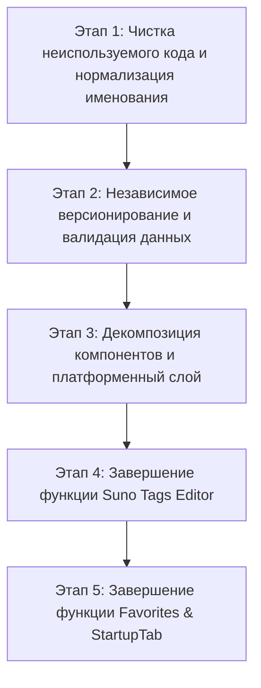

# План рефакторинга проекта E-dit

В данном документе представлен детальный технический анализ текущей кодовой базы E-dit, выявленные расхождения с документацией и требованиями, а также пошаговый план проведения рефакторинга.

---

## 1. Анализ кодовой базы

### 1.1 Разные названия одной функции / концепции
* **Именование команд и функций обрезки пробелов по краям:**
  * В [text.ts](src/lib/commands/text.ts) общая функция очистки краёв каждой строки называется `trimLines`.
  * В [suno.ts](src/lib/commands/suno.ts) очистка переносов в блоках Suno называется `sunoTrim`.
  * Стабильные идентификаторы `text.edges` и `suno.trim`, а также подписи кнопок `"Edges"` и `"Trim"`, сохранены для совместимости интерфейса и существующих пресетов.
* **Вкладка/компонент работы с данными:**
  * Переименовано из `BackupRestore` в `DataPanel` ([DataPanel.tsx](src/components/Data/DataPanel.tsx)).
  * В типах навигации называется `data` ([SlidingDrawer.tsx](src/components/Drawer/SlidingDrawer.tsx)).
  * В UI раздел назван `"Data"`; кнопка открытия находится в [CommandPanel.tsx](src/components/Commands/CommandPanel.tsx), а содержимое — в [DataPanel.tsx](src/components/Data/DataPanel.tsx).

### 1.2 Одинаковые названия у разных функций / сущностей
* **Разграничение команд изменения регистра:**
  * В [text.ts](src/lib/commands/text.ts) `toUpperCase(text)` переводит весь текст в верхний регистр.
  * В [suno.ts](src/lib/commands/suno.ts) `capitalizeSunoLines(text)` переводит в верхний регистр только первую букву каждой текстовой строки и не изменяет теги `[...]`.
  * Стабильные идентификаторы реестра `text.upper` и `suno.upper` не изменены, но внутренние импорты теперь однозначны в [TextCommands.tsx](src/components/Commands/TextCommands.tsx) и [SunoCommands.tsx](src/components/Commands/SunoCommands.tsx).
* **Разграничение команд работы с пробелами:**
  * `collapseSpaces` в `text.ts` — замена множественных пробелов/табов на 1 пробел.
  * `space` в `suno.ts` — нормализация пустых строк вокруг structural tags `[...]`.

### 1.3 Устаревший и неиспользуемый код
* **Файл стилей `App.css`:**
  * В [src/App.css](file:///d:/Documents/Antigravity%20Projects/E-dit%20New/src/App.css) содержатся базовые стили CRA/Vite по умолчанию (`#root`, `.logo`, `.card`, `@keyframes logo-spin`), которые не используются в приложении (в проекте применяется Tailwind CSS).
* **Удалённая сущность `Note` в базе данных:**
  * Интерфейс `Note` и свойство `EditDatabase.notes` удалены из актуального кода. Описания схем v1-v3 сохранены для открытия старых баз, а миграция Dexie v4 удаляет таблицу `notes`, сохраняя данные остальных таблиц.

### 1.4 Дублирование логики
* **Централизованная запись History:**
  * Метод `EditDatabase.addHistory` является единым источником логики сохранения версий, защиты от последовательных дубликатов и ограничения до 50 записей на каждый редактор. `useEditor` только вызывает этот метод и обрабатывает ошибку. Временный Undo Stack остаётся независимым от History.

### 1.5 Слишком сложные или смешанные компоненты
* **`CommandPanel.tsx` разделён на самостоятельные секции:**
  * [CommandPanel.tsx](src/components/Commands/CommandPanel.tsx) отвечает только за общую шапку, навигацию и выбор активной вкладки. [TextCommands.tsx](src/components/Commands/TextCommands.tsx), [SunoCommands.tsx](src/components/Commands/SunoCommands.tsx) и [PresetsCommands.tsx](src/components/Commands/PresetsCommands.tsx) независимо содержат разметку и зависимости своих разделов, а [CommandButton.tsx](src/components/Commands/CommandButton.tsx) сохраняет общий внешний вид кнопок.
* **`DataPanel.tsx` отделён от платформенной работы с файлами:**
  * [DataPanel.tsx](src/components/Data/DataPanel.tsx) зависит только от интерфейса `DataFileAdapter`. Сейчас существует единственная реализация — `BrowserDataFileAdapter` в [dataFileAdapter.ts](src/lib/platform/dataFileAdapter.ts). Адаптеров Tauri и Capacitor в проекте пока нет; позднее их можно добавить без изменения раздела Data.

### 1.6 Расхождения между кодом, интерфейсом, тестами, task.md и implementation_plan.md
* **Пункт 6 Фазы 2 (Favorites & startupTab):**
  * В `task.md` (строка 14) пункт отмечен как невыполненный `[ ]`.
  * В `implementation_plan.md` (секция 6) подробно расписаны требования к избранным командам и закреплению вкладки запуска.
  * В базе данных `AppSettings` ([src/lib/db/index.ts](file:///d:/Documents/Antigravity%20Projects/E-dit%20New/src/lib/db/index.ts#L49-L52)) поля `startupTab` и `favoriteCommandIds` добавлены в тип, но UI управления избранным и стартовой вкладкой не реализован.
* **Пункт 7 Фазы 2 (Suno Tags Full Editor):**
  * В `task.md` (строка 15) пункт `[ ] 7. Suno Tags`.
  * В `implementation_plan.md` требовался полноценный редактор тегов (группировка одинаковых тегов, mass update, редактирование стилей в скобках).
  * В коде [src/components/SunoTags/SunoTagsEditor.tsx](file:///d:/Documents/Antigravity%20Projects/E-dit%20New/src/components/SunoTags/SunoTagsEditor.tsx) реализован только простой билдер новых тегов (`[Chorus x2]`).
* **Пункт 9 Фазы 2 (Data & Platform Layer):**
  * В `implementation_plan.md` требовалась валидация схемы JSON при импорте, обработка ошибок, атомарные транзакции и выделенный сервисный слой `DataFileAdapter`.
  * Строгая валидация Data v2 и атомарный импорт реализованы в [import.ts](src/lib/data/import.ts), а файловые операции изолированы за `DataFileAdapter`. Реализован только браузерный адаптер.

### 1.7 Статус ранее незавершённых задач
* **Пункт 9 Фазы 2 (Data & Platform Layer) выполнен:**
  * Data v2 валидируется и импортируется атомарно, а `DataFileAdapter` отделяет UI от browser API. Сейчас используется только `BrowserDataFileAdapter`; Tauri/Capacitor остаются будущими интеграциями.
* **Связано с Пресетами (Пункт 5):**
  * Отмечен выполненным `[x]`, но пресеты не содержат полноценного UI конструктора цепочек (Chain Editor) и Regex Editor для пользователя, а только отображение имеющихся в DB пресетов ([src/components/Commands/PresetsTab.tsx](file:///d:/Documents/Antigravity%20Projects/E-dit%20New/src/components/Commands/PresetsTab.tsx)).

### 1.8 Проблемы с хранением данных и будущими версиями приложения
* **Безопасная валидация при импорте данных:**
  * Data v2 полностью проверяется до изменения IndexedDB: версия, верхнеуровневая структура, настройки, пресеты, CommandId и regex. Настройки и пресеты заменяются одной транзакцией с rollback при ошибке.
* **Независимое версионирование экспортируемого файла данных:**
  * Формат Data сохраняет собственную `version: 2` ([DataPanel.tsx](file:///d:/Documents/Antigravity%20Projects/E-dit%20New/src/components/Data/DataPanel.tsx#L13)), а внутренняя схема Dexie использует v4 для удаления таблицы `notes`. Эти версии относятся к разным форматам, развиваются независимо, и их несовпадение ожидаемо и не является ошибкой.

---

## 2. Классификация найденных проблем

### Категория A: Рефакторинг существующего кода
1. **Удаление устаревших стилей CRA/Vite (`App.css`).** (Важность: Низкая)
2. **Централизация логики записи History в IndexedDB (`addHistory`).** Выполнено: сохранение, дедупликация и лимит реализованы в слое базы данных. (Важность: Средняя)
3. **Разделение UI и файловых операций через `DataFileAdapter`.** Выполнено для браузера; нативные реализации ещё не созданы. (Важность: Средняя)
4. **Унификация наименований команд и UI-элементов.** (Важность: Средняя)

### Категория B: Реальные ошибки
1. **Строгая runtime-валидация при импорте JSON данных.** Выполнено для Data v2 с атомарным импортом. (Важность: Высокая)
2. **Отсутствие обработки невалидных данных пресетов при их выполнении из UI.** (Важность: Средняя)

### Категория C: Ещё не реализованные функции
1. **Реализация Фазы 2.6: Избранные команды и Стартовая вкладка (`startupTab` & `favoriteCommandIds`).** (Важность: Высокая)
2. **Реализация Фазы 2.7: Полноценный групповой редактор тегов Suno (Suno Tags Editor).** (Важность: Высокая)
3. **Реализация Конструктора Пресетов (Preset Builder for Chains and Regex).** (Важность: Средняя)

---

## 3. Единый словарь названий

| Сущность / Функция / Компонент | Текущие варианты в коде | Единое утверждённое название | Область применения |
| :--- | :--- | :--- | :--- |
| Обрезка пробелов в начале/конце строк | ID `text.edges`, `suno.trim`; кнопки `"Edges"`, `"Trim"` | `trimLines` (модуль text), `sunoTrim` (модуль suno) | Внутренние функции; ID и подписи стабильны |
| Изменение регистра | ID `text.upper`, `suno.upper`; кнопки `"Upper"`, `"Suno Upper"` | `toUpperCase` / `capitalizeSunoLines` | Весь текст / первая буква каждой строки вне тегов |
| Очистка повторяющихся пробелов | ID `text.spaces`; кнопка `"Spaces"` | `collapseSpaces` | Нормализация внутристрочных пробелов |
| Раздел/Вкладка данных | `data`, `DataPanel`, button `"Data"` | `DataPanel` / вкладка `data` | UI и навигация |
| Редактор тегов Suno | `SunoTagsEditor` (на самом деле Tag Builder) | `SunoTagBuilder` (для вставки), `SunoTagManager` (для редактирования) | Компоненты работы с тегами |
| Таблица заметок в БД | `notes` в исторических схемах v1-v3 | Удалена миграцией v4 | Хранилище Dexie |

---

## 4. Пошаговый план рефакторинга

---

### Этап 1: Чистка неиспользуемого кода и нормализация именования

* **Что исправляется:** Удаляется неиспользуемый файл `src/App.css`, а интерфейс `Note` и свойство `EditDatabase.notes` уже удалены; схемы Dexie v1-v3 сохранены без изменений, и версия 4 фактически удаляет таблицу `notes` при миграции. Имена функций в `src/lib/commands/` приведены к словарю выше без изменения постоянных `CommandId`.
* **Зачем это нужно:** Избавление от "мертвого" кода, устранение путаницы в названиях функций и импортах.
* **Какие файлы затрагиваются:**
  * [DELETE] `src/App.css`
  * [MODIFY] [src/App.tsx](file:///d:/Documents/Antigravity%20Projects/E-dit%20New/src/App.tsx)
  * [MODIFY] [src/lib/db/index.ts](file:///d:/Documents/Antigravity%20Projects/E-dit%20New/src/lib/db/index.ts)
  * [MODIFY] [src/lib/commands/text.ts](src/lib/commands/text.ts)
  * [MODIFY] [src/lib/commands/suno.ts](src/lib/commands/suno.ts)
  * [MODIFY] [src/lib/commands/registry.ts](src/lib/commands/registry.ts)
* **От каких этапов зависит:** Нет зависимостей.
* **Как проверить результат:** Запуск `npx vitest run` и `npm run build` должен проходить без ошибок типов и тестов.
* **Какой риск имеет изменение:** Низкий.

---

### Этап 2: Независимое версионирование Data и Dexie, валидация импорта

* **Что исправляется:**
  1. Формат Data v2 и схема Dexie v4 версионируются независимо; совпадение номеров версий между ними не требуется.
  2. Реализована строгая валидация JSON-схемы Data v2 до импорта (версия, `presets`, `settings`, структура `PresetData`) и атомарная замена обеих таблиц.
  3. Логика записи History централизована в `EditDatabase.addHistory`; `useEditor` делегирует ей сохранение версий, дедупликацию и лимит.
* **Зачем это нужно:** Предотвращение порчи IndexedDB при импорте некорректных файлов, гарантия целостности данных пользователя.
* **Какие файлы затрагиваются:**
  * [MODIFY] [src/lib/db/index.ts](file:///d:/Documents/Antigravity%20Projects/E-dit%20New/src/lib/db/index.ts)
  * [MODIFY] [src/hooks/useEditor.ts](file:///d:/Documents/Antigravity%20Projects/E-dit%20New/src/hooks/useEditor.ts)
  * [src/lib/data/import.ts](src/lib/data/import.ts)
  * [src/components/Data/DataPanel.tsx](src/components/Data/DataPanel.tsx)
  * [tests/dataImport.test.ts](tests/dataImport.test.ts)
* **От каких этапов зависит:** Зависит от Этапа 1.
* **Как проверить результат:** Новые Vitest тесты с валидным, поврежденным и устаревшим JSON файлом данных.
* **Какой риск имеет изменение:** Средний (затрагивает операции записи в IndexedDB).

---

### Этап 3: Декомпозиция UI-компонентов и Платформенный слой

* **Что исправляется:**
  1. Абстракция `DataFileAdapter` и единственная текущая реализация `BrowserDataFileAdapter` выделены: выбор, чтение и сохранение файлов изолированы от `DataPanel.tsx`. Реализации Tauri/Capacitor отсутствуют и запланированы на будущие фазы.
  2. `CommandPanel.tsx` разделён на `TextCommands`, `SunoCommands` и `PresetsCommands`; общая кнопка вынесена в `CommandButton`.
* **Зачем это нужно:** Подготовка к будущей интеграции с Tauri (Desktop) и Capacitor (Mobile), соблюдение чистоты архитектуры.
* **Какие файлы затрагиваются:**
  * [src/lib/platform/dataFileAdapter.ts](src/lib/platform/dataFileAdapter.ts)
  * [src/components/Data/DataPanel.tsx](src/components/Data/DataPanel.tsx)
  * [tests/dataFileAdapter.test.tsx](tests/dataFileAdapter.test.tsx)
  * [src/components/Commands/CommandPanel.tsx](src/components/Commands/CommandPanel.tsx)
  * [src/components/Commands/TextCommands.tsx](src/components/Commands/TextCommands.tsx)
  * [src/components/Commands/SunoCommands.tsx](src/components/Commands/SunoCommands.tsx)
  * [src/components/Commands/PresetsCommands.tsx](src/components/Commands/PresetsCommands.tsx)
  * [src/components/Commands/CommandButton.tsx](src/components/Commands/CommandButton.tsx)
  * [tests/CommandPanel.test.tsx](tests/CommandPanel.test.tsx)
* **От каких этапов зависит:** Зависит от Этапа 2.
* **Как проверить результат:** Ручная и автоматизированная проверка работы импорта/экспорта в браузере.
* **Какой риск имеет изменение:** Низкий.

---

### Этап 4: Завершение функции Suno Tags Editor (Фаза 2.7)

* **Что исправляется:** Доработка редактора Suno-тегов в соответствии с требованиями `implementation_plan.md`: парсинг существующих тегов в тексте, их группировка, массовое обновление и редактирование стилей в скобках.
* **Зачем это нужно:** Выполнение запланированного функционала Фазы 2.
* **Какие файлы затрагиваются:**
  * [NEW] `src/lib/suno/parser.ts`
  * [MODIFY] [src/components/SunoTags/SunoTagsEditor.tsx](file:///d:/Documents/Antigravity%20Projects/E-dit%20New/src/components/SunoTags/SunoTagsEditor.tsx)
  * [NEW] `tests/sunoParser.test.ts`
  * [MODIFY] [task.md](file:///d:/Documents/Antigravity%20Projects/E-dit%20New/task.md)
* **От каких этапов зависит:** Зависит от Этапа 1 и 3.
* **Как проверить результат:** Vitest тесты чистых функций парсера тегов и UI-тесты редактора.
* **Какой риск имеет изменение:** Средний.

---

### Этап 5: Завершение функции Favorites & StartupTab (Фаза 2.6)

* **Что исправляется:** Реализация UI для добавления команд в Избранное (`favoriteCommandIds`) и возможность выбора/закрепления стартовой вкладки (`startupTab`) при загрузке приложения.
* **Зачем это нужно:** Закрытие последнего нереализованного пункта Фазы 2.
* **Какие файлы затрагиваются:**
  * [MODIFY] [src/components/Commands/CommandPanel.tsx](src/components/Commands/CommandPanel.tsx) — навигация новой вкладки.
  * [MODIFY] [src/components/Commands/TextCommands.tsx](src/components/Commands/TextCommands.tsx) и [PresetsCommands.tsx](src/components/Commands/PresetsCommands.tsx) — отображение избранного.
  * [MODIFY] [src/App.tsx](file:///d:/Documents/Antigravity%20Projects/E-dit%20New/src/App.tsx)
  * [NEW] `tests/favorites.test.ts`
  * [MODIFY] [task.md](file:///d:/Documents/Antigravity%20Projects/E-dit%20New/task.md)
* **От каких этапов зависит:** Зависит от Этапа 3 и 4.
* **Как проверить результат:** Проверка сохранения выбранной вкладки в `AppSettings` в IndexedDB и её загрузки при старте приложения.
* **Какой риск имеет изменение:** Низкий.
